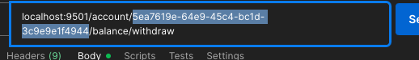

# Introductions

1. In folder from project execute this command:
```
  docker-compose up -d
```
Whait downdload the image and start the containers

2. Enter the application container
```
  docker exec -it pix-manager-app-1 bash
``` 
Obs: pix-manager-app - is name container for default

3. Execute Migrations
```
  php bin/hyperf.php migrate:install
```

## Execute API
The API start execute automatically up container

Obs:
  * the default port is 9501, check this port not in use.

In folder `doc` has a file `postman_collection.json` with maping request.

In route withdraw has id in format UUID
 

this ID is random generate then my ID is diff your, check your ID in Database in table `accounts`.


## Check Pix Scheduled
```
  php bin/hyperf.php pix-schedule
```